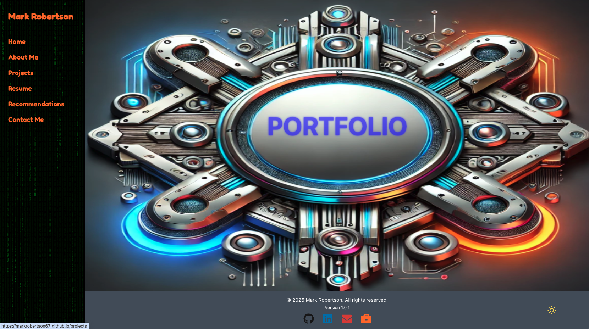

# My Portfolio App

[](LICENSE)
[](https://reactjs.org/)
[](https://tailwindcss.com/)
[](https://www.npmjs.com/package/mark_robertson_portfolio)


This is a personal portfolio website built with [React](https://reactjs.org/), [React Router](https://reactrouter.com/), and [Tailwind CSS](https://tailwindcss.com/). The app showcases my projects, resume, recommendations, and contact details with a modern, responsive design. It features a full-screen background image with a neon flicker effect on the text and mobile-friendly navigation.




---

## Table of Contents

- [Features](#features)
- [Technologies Used](#technologies-used)
- [Installation](#installation)
- [Deployment](#deployment)
- [Project Structure](#project-structure)
- [Configuration](#configuration)
  - [React Router Future Flags](#react-router-future-flags)
  - [Neon Text Animation](#neon-text-animation)
- [Contributing](#contributing)
- [License](#license)
- [Acknowledgments](#acknowledgments)

---


## Features

- **Responsive Design:**  
  Adaptable layout for both desktop and mobile devices with a side menu on desktop and a hamburger menu on mobile.
- **Client-side Routing:**  
  Navigates between pages using React Router with a custom 404 fallback for GitHub Pages.
- **Neon Flicker Effect:**  
  Custom CSS animations create a faulty neon light effect on key text elements.
- **Full-screen Background:**  
  Uses a background image that covers the entire viewport without scrolling.
- **Easy Navigation:**  
  Clickable areas and intuitive menus allow quick access to different sections of the portfolio.

## Technologies Used

- **[React](https://reactjs.org/)** – For building user interfaces.
- **[React Router](https://reactrouter.com/)** – For managing client-side routing.
- **[Tailwind CSS](https://tailwindcss.com/)** – For rapid styling with utility-first classes.
- **Custom CSS** – For animations and unique design effects (e.g., neon flicker).
- **[GitHub Pages](https://pages.github.com/)** – For deployment of the static site.


## Installation

1. **Clone the repository:**

   git clone https://github.com/yourusername/your-portfolio-app.git
   cd your-portfolio-app

### Install dependencies:

npm install
### or
yarn install

npm start
### or
yarn start

The app will run at http://localhost:3000.

## Deployment:

### To deploy this app to GitHub Pages:

npm run build
# or
yarn build

### Deploy using GitHub Pages:

You can use the [gh-pages](https://www.npmjs.com/package/gh-pages) package to deploy your build folder. For more details, see the [Create React App deployment documentation](https://create-react-app.dev/docs/deployment/#github-pages).


## Project Structure:

```plaintext
my-portfolio-app/
├── public/
│   ├── index.html
│   ├── 404.html
│   └── ...
├── src/
│   ├── components/
│   │   ├── Layout/
│   │   ├── Navbar/
│   │   └── ...
│   ├── pages/
│   │   ├── Home.js
│   │   ├── Projects.js
│   │   ├── Resume.js
│   │   ├── AboutMe.js
│   │   ├── Recommendations.js
│   │   └── ContactMe.js
│   ├── App.js
│   ├── index.js
│   └── ...
├── package.json
└── README.md
```

## Configuration:

### React Router Future Flags:

The app uses future flags for React Router to enable new relative splat path resolution and state updates wrapped in React.startTransition. These flags are set in index.js:

```jsx
<BrowserRouter future={{ v7_relativeSplatPath: true, v7_startTransition: true }}>
  <App />
</BrowserRouter>
```

### Neon Text Animation:

The neon flicker effect is implemented in a CSS file (e.g., Home.css). You can adjust the animation parameters to fine-tune the faulty neon effect.

```css
@keyframes neon-flicker {
  0%, 18%, 22%, 25%, 53%, 57%, 100% {
    text-shadow:
      0 0 2px #ff0000,
      0 0 4px #ff0000,
      0 0 8px #ff0000,
      0 0 12px #ff0000;
    opacity: 1;
  }
  20%, 24%, 55% {
    text-shadow: none;
    opacity: 0.3;
  }
}

.neon-text {
  color: #ff0000; /* Red text - update this to blue or any color as needed */
  animation: neon-flicker 1.5s infinite alternate;
}
```


## Contributing:

Contributions are welcome! Please fork the repository and submit a pull request with your improvements. For major changes, please open an issue first to discuss your ideas.

## License:

This project is licensed under the MIT License. See the LICENSE file for details.

## Acknowledgments:

React

React Router

Tailwind CSS

Inspiration from modern, minimal portfolio designs.

